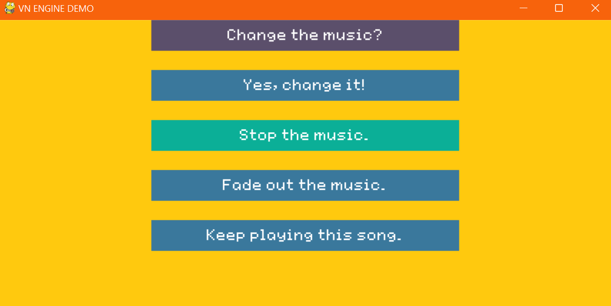

# VN-Game-Engine
Engine for a visual novel style game built with Pygame.
## Modules needed
pygame, sys, os, shelve.
## Running the game
Running vn_engine.py demonstrates core features.

## Screenshots

